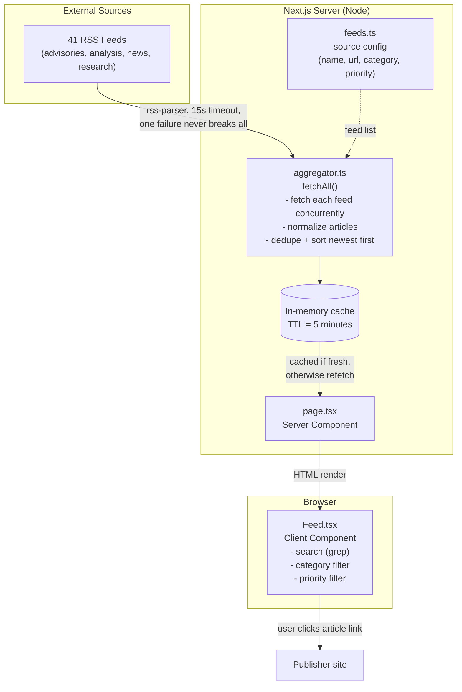

# Architecture

## How a request flows

1. User opens the app → `page.tsx` calls `getArticles()`.
2. If the in-memory cache is younger than 5 minutes, the cached result is used — no network calls.
3. Otherwise, `aggregator.ts` fetches all 41 feeds concurrently (`Promise.allSettled`), so one dead feed never breaks the page.
4. Each item is normalized into an `Article` (title, link, source, category, priority, date, excerpt), HTML is stripped from excerpts, duplicates are removed, and everything is sorted newest-first.
5. The result is cached for 5 minutes and rendered as a server component.
6. The browser component (`Feed.tsx`) handles search and filtering entirely client-side — no extra requests.

## Failure handling

- A failing feed is logged in the result's `failed` list and the footer shows it as `stale` — the page still renders with the other 40.
- In-flight dedupe: if two requests arrive while a fetch is running, they share the same promise instead of triggering two fetch storms.
